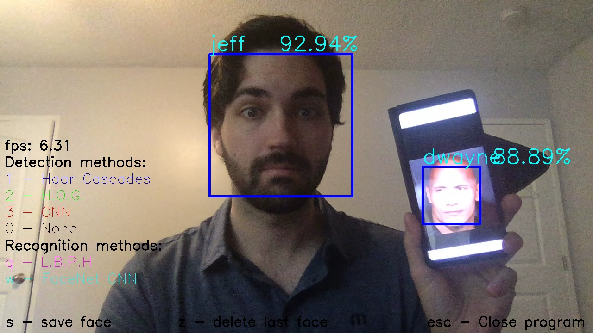

# About

This is a simple app I made a while back for performing real-time facial recognition. The app allows you to mix and match between different face detection/recognition algorithms, to experiment with which combinations yield the best results (in terms of accuracy, speed, etc).

## Dependencies

This project uses Keras and Tensorflow for neural network calculations, dlib for the HoG face detection method, and opencv for webcam streaming. These can all be installed via the following commands:

> pip install tensorflow
>
> pip install keras
>
> pip install opencv
>
> pip install dlib

The app was built and tested in python 3.6 - it may work in later versions but hasn't been tested.

## How to use

After downlooading and unzipping the project, go to the project's directory.

1. python main.py
2. A prompt will come up asking for your name - this is to initialize a training set for performing facial recognition.
3. A new window will come up with a live webcam stream. Toggle between the different face detection methods with 1, 2, and 3, and recognition methods with 'q' and 'w'.

When you first use the program, you will need to train the algorithms no your face. You can do this by the following:

1. With the webcam stream up, press 's' to take a screenshot of your face - this is needed for training. Take a handful of pictures, at various and angles and lighting if possible, for best results.
2. Close the app, and run the file 'train.py' to train (or retrain) all facial recognition methods on the new training set.
3. Re-run main.py

## About me

I'm a Physics PhD-turned-data-scientist, with an emphasis on computer vision and deep learning methods. If you have any questions about me, this project, or something else, feel free to reach out:

* [linkedin](https://www.linkedin.com/in/jeffsrobertson/)
